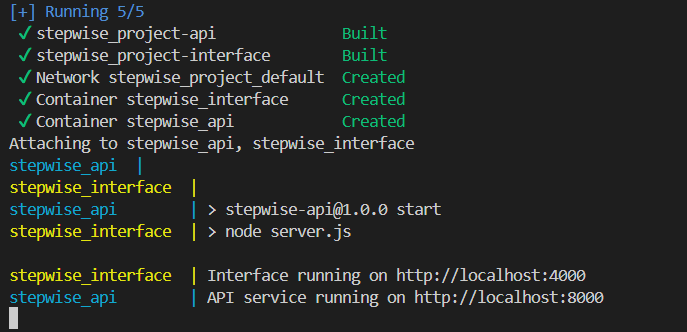
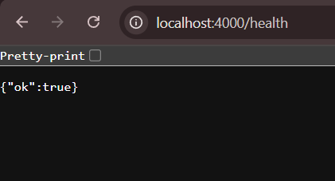
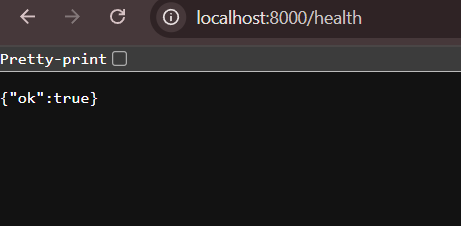
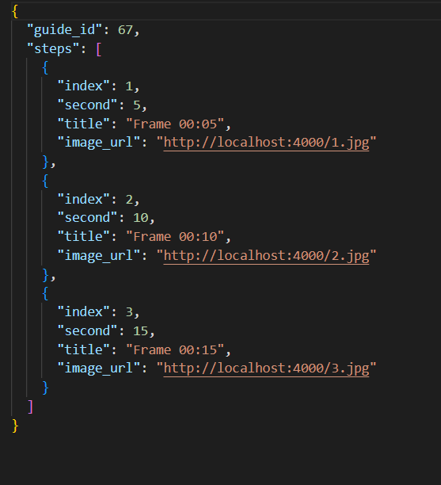

# **Overview**

This project consists of two services:
 - API service (api) – Handles video processing requests and sends steps to a callback.
 - Interface service (interface) – Receives the steps via callback and displays them in a simple web interface.
The project is containerized using Docker Compose.

# **Setup**
   Prerequisites
   - Docker Desktop installed<br>
   - Docker Compose available<br>
   - Copy `.env.example` into `.env`:

  ```bash
     cp .env.example .env
  ```


# **Build and Start Services**

```bash
   docker compose up --build
```

   Services will start on:
   
   ```bash
      API: http://localhost:8000
      Interface: http://localhost:4000
   ```
      
   

 **Testing the Workflow**
1. Check health endpoints
```bash
   curl http://localhost:8000/health
   curl http://localhost:4000/health
```

   - Expected response:
     ```bash
      { "ok": true }
     ```
      
      
     <br>

      <br>

3. Trigger pipeline (file upload)
 Upload a local video:

```bash
   curl -X POST http://localhost:8000/process-video \
     -H "Authorization: Bearer stepwize_test" \
     -F "file=@/path/to/sample_video.mp4" \
     -F "guide_id=67" \
     -F "callback_url=http://host.docker.internal:4000/callbacks/steps"
```

 Or using a remote URL:
 ```bash
   curl -X POST http://localhost:8000/process-video \
     -H "Authorization: Bearer stepwize_test" \
     -H "Content-Type: application/json" \
     -d '{"video_url":"https://example.com/video.mp4","guide_id":67,"callback_url":"http://host.docker.internal:4000/callbacks/steps"}'
```

  

4. Open guide in browser
   Visit:
   ```bash
     http://localhost:4000/guides/67
   ```
   You should see 3 steps displayed with titles and images.
   
   

**Note**
   - Use
  ```bash
    docker compose down --volumes
```
   to reset the services.

**Environment Hygiene**
  - `.env` is **not committed** to the repository for security.
  - Only `.env.example` is tracked (safe default values).
  - To run locally, always copy `.env.example` → `.env` before starting services.


